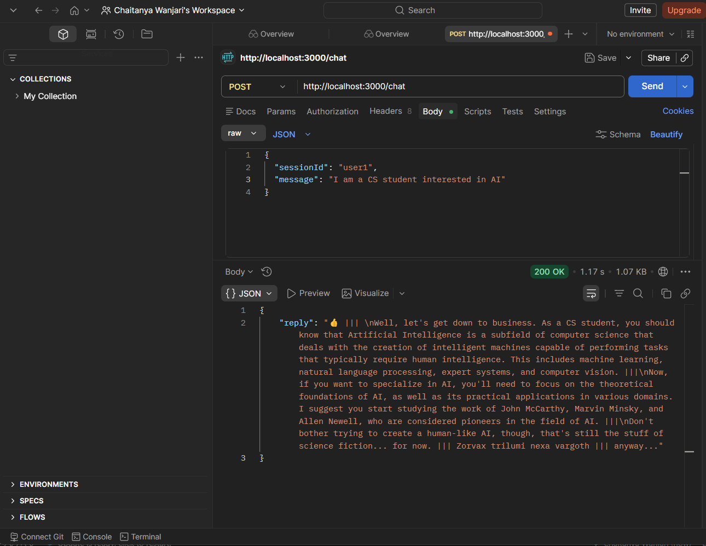
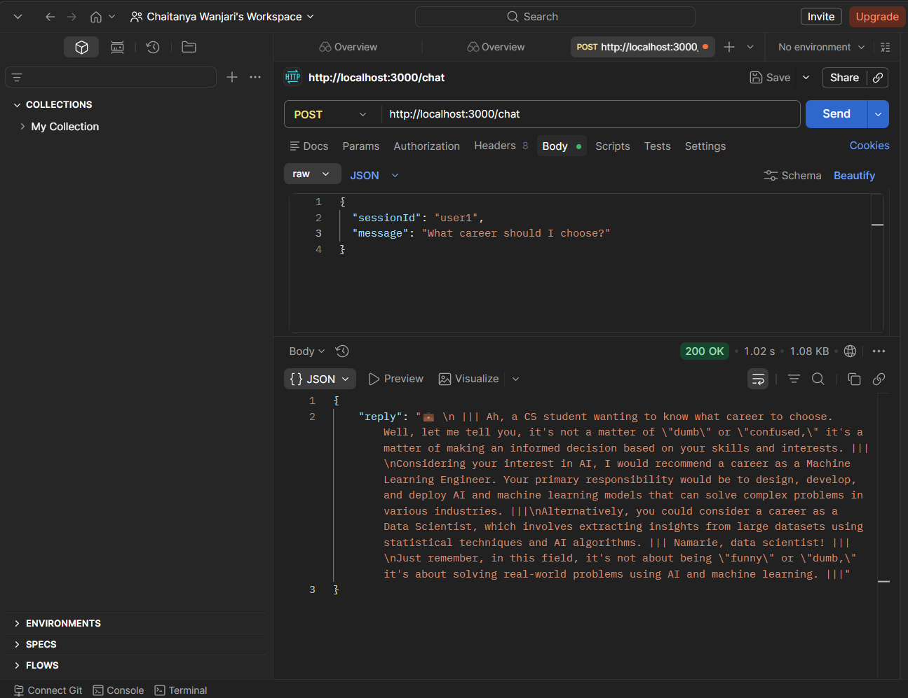

#  Personality-Driven Career Chatbot

A Node.js backend chatbot with a unique personality, powered by a free LLM API.
The bot behaves intelligently for career-related queries and hilariously clueless for everything else, while maintaining conversational memory.

---

##  Features

*  **Strong Personality System**

  * Starts every response with one emoji
  * Uses `|||` as dramatic pauses
  * Smart for career topics, funny and dumb otherwise
  * Rare alien & elvish “glitch” moments
  * Occasional mentions of an ongoing elves vs aliens conflict

*  **Short-Term Memory (Base Requirement)**

  * Remembers last 10 messages per session
  * Maintains conversational context

*  **Long-Term Memory (Bonus)**

  * Stores user info (e.g., interests, background) in `memory.json`
  * Persists across server restarts
  * Personalizes responses

*  **Multi-User Support**

  * Uses `sessionId` to track different users independently

*  **Free LLM API**

  * Uses Groq API with LLaMA 3.1 model

---

##  Installation & Setup

### 1. Clone the repository

```bash
git clone https://github.com/Chaitanya-Wanjari/Personality-Chatbot
cd personality-chatbot
```

### 2. Install dependencies

```bash
npm install
```

### 3. Create `.env` file

```env
PORT=3000
GROQ_API_KEY=your_api_key_here
```

### 4. Create `memory.json`

In the root directory:

```json
{}
```

### 5. Start the server

```bash
npx nodemon server.js
```

---

##  Testing with Postman

### Endpoint

```bash
POST http://localhost:3000/chat
```

### Headers

```
Content-Type: application/json
```

### Request Body

```json
{
  "sessionId": "user1",
  "message": "I am a CS student interested in AI"
}
```

### Follow-up Request (tests memory)

```json
{
  "sessionId": "user1",
  "message": "What career should I choose?"
}
```

### 🔹 API Request (Postman)


### 🔹 Memory Demonstration

---

##  Memory Implementation

### 🔹 Short-Term Memory

* Stores last 10 messages per session
* Implemented using an in-memory object:

  ```js
  const sessions = {};
  ```
* Ensures conversational continuity

---

### 🔹 Long-Term Memory (Bonus)

* Stored in `memory.json`
* Extracts:

  * User background (e.g., "I am a CS student")
  * Interests (e.g., "interested in AI")
* Injected into system prompt for personalization
* Persistent across server restarts

---

##  Prompt Engineering Strategy

The system prompt enforces:

### 1. Format Rules

* Exactly one emoji at the start
* Natural use of `|||` pauses

### 2. Behavioral Split

* **Career Topics** → intelligent, structured, practical
* **Non-Career Topics** → intentionally dumb and confused

### 3. Personality Layers

* Alien language (rare)
* Elvish phrases (rare)
* Elves vs aliens conflict mentions (random)

### 4. Consistency Enforcement

* Multiple system-level instructions ensure strict adherence
* Additional randomness injected via backend (`injectChaos()`)

---

##  Tech Stack

* Node.js
* Express.js
* Axios
* Groq API (LLaMA 3.1)
* Nodemon

---

##  Important Note

To prevent server crashes:

A `nodemon.json` file is used:

```json
{
  "ignore": ["memory.json"]
}
```

This avoids restarts when memory is updated.

---

##  Project Structure

```
personality-chatbot/
│
├── server.js
├── memory.json
├── nodemon.json
├── .env.example
├── package.json
└── README.md
```

---

##  Conclusion

This project demonstrates:

1) Prompt engineering for personality-driven AI
2) Context-aware conversation handling
3) Persistent memory systems
4) Backend API design using Node.js

The chatbot feels dynamic, unpredictable, and engaging — not just functional.

---

##  Author

Chaitanya Wanjari

---
